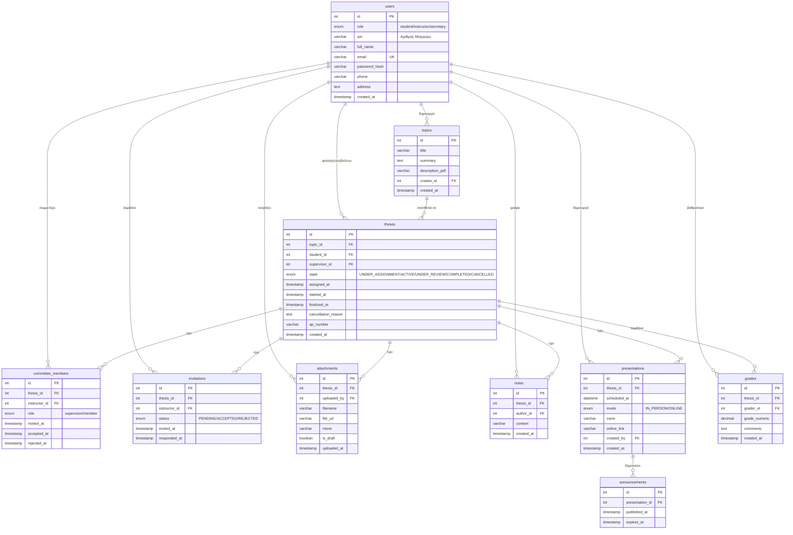

# Παραδοτέα - Thesis Management System

## Περιεχόμενα
- [a. Σχεδιασμός Βάσης Δεδομένων (ER Diagram)](#a-σχεδιασμός-βάσης-δεδομένων-er-diagram)
- [b. Παρουσίαση Εφαρμογής (Screenshots)](#b-παρουσίαση-εφαρμογής-screenshots)
- [c. Ρυθμίσεις Κρυφών Μνημών (Caching)](#c-ρυθμίσεις-κρυφών-μνημών-caching)
- [d. Πηγαίος Κώδικας και Export ΒΔ](#d-πηγαίος-κώδικας-και-export-βδ)

---

## a. Σχεδιασμός Βάσης Δεδομένων (ER Diagram)

### Entity-Relationship Diagram



### Περιγραφή Πινάκων

| Πίνακας | Περιγραφή |
|---------|-----------|
| **users** | Αποθηκεύει όλους τους χρήστες (φοιτητές, καθηγητές, γραμματεία) με τα στοιχεία τους |
| **topics** | Θέματα διπλωματικών που δημιουργούνται από καθηγητές |
| **theses** | Διπλωματικές εργασίες με την κατάσταση κύκλου ζωής τους |
| **committee_members** | Μέλη τριμελούς επιτροπής ανά διπλωματική |
| **invitations** | Προσκλήσεις συμμετοχής σε επιτροπές |
| **attachments** | Αρχεία που ανεβαίνουν (drafts, τελικά κείμενα) |
| **notes** | Ιδιωτικές σημειώσεις χρηστών για διπλωματικές |
| **presentations** | Προγραμματισμός παρουσιάσεων/εξετάσεων |
| **grades** | Βαθμολογίες από μέλη επιτροπής |
| **announcements** | Ανακοινώσεις παρουσιάσεων |

### Κύκλος Ζωής Διπλωματικής (State Machine)


---

## b. Παρουσίαση Εφαρμογής (Screenshots)

Τα screenshots βρίσκονται στον φάκελο `docs/screenshots/`.

### Screenshot 1: Σελίδα Σύνδεσης (Login)


**Περιγραφή:** Η αρχική σελίδα σύνδεσης με:
- Λογότυπο "Thesis Management System"
- Φόρμα email/password
- Κουμπιά demo λογαριασμών (Student, Instructor, Secretary)
- Gradient μπλε φόντο

---

### Screenshot 2: Dashboard Φοιτητή


**Περιγραφή:** Το dashboard του φοιτητή εμφανίζει:
- Navbar με τα μενού: Overview, Topics, Theses, Committees, Presentations, Grades
- Stats cards: Available Topics, My Theses, Committee Roles, Average Grade
- Recent Activity panel
- Quick Actions: Browse Topics, View Schedule
- My Profile card με στοιχεία φοιτητή

---

### Screenshot 3: Dashboard Καθηγητή (Instructor)


**Περιγραφή:** Το dashboard του καθηγητή με:
- Quick Action: "Create Topic" κουμπί (μόνο για instructors)
- Στατιστικά επιβλεπόμενων διπλωματικών
- Pending invitations για επιτροπές

---

### Screenshot 4: Dashboard Γραμματείας (Secretary)


**Περιγραφή:** Το dashboard της γραμματείας με:
- Admin tab στο navbar
- Πλήρης πρόσβαση σε όλες τις διπλωματικές
- Export & Reports κουμπιά
- System Health status

---

### Screenshot 5: Λίστα Θεμάτων (Topics)


**Περιγραφή:** Grid με κάρτες θεμάτων που περιλαμβάνουν:
- Τίτλο θέματος
- Σύνοψη
- Δημιουργός
- Κουμπιά: View Details, Edit (για τον δημιουργό)

---

### Screenshot 6: Δημιουργία Νέου Θέματος (Modal)


**Περιγραφή:** Modal φόρμας με πεδία:
- Title (υποχρεωτικό)
- Summary (textarea)
- Description PDF URL
- Cancel / Create Topic buttons

---

### Screenshot 7: Λίστα Διπλωματικών (Theses)


**Περιγραφή:** Grid με κάρτες διπλωματικών:
- Τίτλος θέματος
- Κατάσταση (UNDER_ASSIGNMENT, ACTIVE, UNDER_REVIEW, COMPLETED, CANCELLED) με χρωματικό badge
- Φοιτητής & Επιβλέπων
- Ημερομηνίες
- Filter dropdown για φιλτράρισμα κατά κατάσταση

---

### Screenshot 8: Λεπτομέρειες Διπλωματικής (Modal)


**Περιγραφή:** Modal με:
- Topic Information section
- Committee Members με status (Accepted/Pending)
- Attachments list με download buttons
- Actions section (ανάλογα με τον ρόλο)

---

### Screenshot 9: Comprehensive Report (Modal)


**Περιγραφή:** Report με:
- Overall Statistics (total theses, per status)
- Supervisor Statistics table
- Grading Statistics

---

### Screenshot 10: Admin Panel (Secretary)


**Περιγραφή:** Σελίδα διαχείρισης με:
- System Health card
- Export & Reports buttons
- Statistics overview

---

### Screenshot 11: Browser DevTools - Network Tab (Caching)


**Περιγραφή:** DevTools Network tab που δείχνει:
- `styles.css` με `Cache-Control: public, max-age=604800`
- `app.js` με `Cache-Control: public, max-age=604800`
- ETag headers
- Status 304 (Not Modified) για cached resources

---

### Screenshot 12: Caching Headers Detail


**Περιγραφή:** Zoom στα Response Headers:
```
Cache-Control: public, max-age=604800
ETag: "abc123..."
Last-Modified: Sat, 01 Feb 2026 10:00:00 GMT
```

---

## c. Ρυθμίσεις Κρυφών Μνημών (Caching)

### Επισκόπηση

Η εφαρμογή υλοποιεί HTTP caching χρησιμοποιώντας τα Express.js static middleware options. Οι ρυθμίσεις βασίζονται στις βέλτιστες πρακτικές που περιγράφονται στη βιβλιογραφία.

### Υλοποίηση στον Κώδικα

Οι ρυθμίσεις βρίσκονται στο αρχείο `src/app.js`:

```javascript
// Public assets (CSS, JS, images) - cache for 7 days
app.use(
  express.static(path.join(__dirname, "../public"), {
    maxAge: "7d", // 7 days for CSS/JS/images
    etag: true, // Enable ETag for conditional requests
    lastModified: true, // Enable Last-Modified header
    setHeaders: (res, filepath) => {
      // HTML files should not be cached to ensure users get latest version
      if (filepath.endsWith(".html")) {
        res.setHeader("Cache-Control", "no-cache, must-revalidate");
      }
      // CSS and JS files - long cache
      else if (filepath.endsWith(".css") || filepath.endsWith(".js")) {
        res.setHeader("Cache-Control", "public, max-age=604800"); // 7 days
      }
      // Images and fonts - can be cached longer
      else if (
        filepath.match(/\.(png|jpg|jpeg|gif|ico|svg|woff|woff2|ttf|eot)$/)
      ) {
        res.setHeader("Cache-Control", "public, max-age=2592000"); // 30 days
      }
    },
  })
);

// Uploaded files (thesis documents, PDFs) - cache for 1 day
app.use(
  "/uploads",
  express.static(path.join(__dirname, "../uploads"), {
    maxAge: "1d", // 1 day for uploaded documents
    etag: true,
    lastModified: true,
    setHeaders: (res, filepath) => {
      if (filepath.endsWith(".pdf")) {
        res.setHeader("Cache-Control", "public, max-age=86400"); // 1 day
      } else {
        res.setHeader("Cache-Control", "public, max-age=86400"); // 1 day
      }
    },
  })
);
```

### Πίνακας TTL ανά Τύπο Αρχείου

| Τύπος Αρχείου | Cache-Control | TTL | Αιτιολόγηση |
|---------------|---------------|-----|-------------|
| HTML | `no-cache, must-revalidate` | 0 | Πάντα να ελέγχεται για νέα έκδοση |
| CSS | `public, max-age=604800` | 7 ημέρες | Σπάνια αλλάζει, μεγάλο μέγεθος |
| JavaScript | `public, max-age=604800` | 7 ημέρες | Σπάνια αλλάζει, κρίσιμο για performance |
| Εικόνες (PNG, JPG, etc.) | `public, max-age=2592000` | 30 ημέρες | Στατικά assets, δεν αλλάζουν |
| Fonts (WOFF, TTF) | `public, max-age=2592000` | 30 ημέρες | Ποτέ δεν αλλάζουν |
| PDF/Documents | `public, max-age=86400` | 1 ημέρα | Μπορεί να ενημερωθούν από χρήστες |

### Cache Headers που Χρησιμοποιούνται

| Header | Τιμή | Σκοπός |
|--------|------|--------|
| **Cache-Control** | `public, max-age=N` | Καθορίζει πόσο διάστημα να κρατηθεί στην cache |
| **ETag** | hash του αρχείου | Επιτρέπει conditional requests (304 Not Modified) |
| **Last-Modified** | ημερομηνία | Εναλλακτικό validation mechanism |

### Διαδικασία Conditional Request


### Αποτελέσματα Cache Configuration

Τα screenshots στον φάκελο `docs/screenshots/` (11-devtools-caching.png, 12-caching-headers-detail.png) επιβεβαιώνουν ότι:

1. **CSS/JS αρχεία:** Επιστρέφουν `Cache-Control: public, max-age=604800`
2. **ETag headers:** Υπάρχουν για όλα τα static files
3. **304 Responses:** Το browser λαμβάνει 304 Not Modified για cached resources
4. **Bandwidth savings:** Μειωμένη χρήση bandwidth λόγω caching

### Βιβλιογραφία και Αναφορές

1. **MDN Web Docs - HTTP Caching**
   - URL: https://developer.mozilla.org/en-US/docs/Web/HTTP/Caching
   - Περιγραφή: Πλήρης οδηγός για HTTP caching mechanisms, Cache-Control directives, και validation strategies.

2. **web.dev - HTTP Cache**
   - URL: https://web.dev/articles/http-cache
   - Περιγραφή: Best practices για caching configuration σε web applications, με focus στο performance optimization.

3. **RFC 7234 - HTTP/1.1 Caching**
   - URL: https://tools.ietf.org/html/rfc7234
   - Περιγραφή: Επίσημη προδιαγραφή του HTTP caching protocol.

4. **Express.js Static Files Documentation**
   - URL: https://expressjs.com/en/starter/static-files.html
   - Περιγραφή: Τεκμηρίωση για τη χρήση express.static() με caching options.

5. **Google Web Fundamentals - Caching Best Practices**
   - URL: https://developers.google.com/web/fundamentals/performance/optimizing-content-efficiency/http-caching
   - Περιγραφή: Οδηγίες της Google για αποτελεσματικό HTTP caching.

### Security Headers (Bonus)

Πέρα από το caching, η εφαρμογή χρησιμοποιεί **Helmet.js** για security headers:

```javascript
app.use(
  helmet({
    contentSecurityPolicy: {
      directives: {
        defaultSrc: ["'self'"],
        styleSrc: ["'self'", "'unsafe-inline'", "https://cdnjs.cloudflare.com"],
        scriptSrc: ["'self'", "'unsafe-inline'", "https://cdnjs.cloudflare.com"],
        imgSrc: ["'self'", "data:", "https:"],
      },
    },
  })
);
```

---

## d. Πηγαίος Κώδικας και Export ΒΔ

### Δομή Πηγαίου Κώδικα

```
thesis-management-system/
├── src/
│   ├── app.js                 # Main application, caching config
│   ├── config/
│   │   └── database.js        # MySQL connection pool
│   ├── controllers/
│   │   ├── attachmentsController.js
│   │   ├── authController.js
│   │   ├── gradesController.js
│   │   ├── invitationsController.js
│   │   ├── presentationsController.js
│   │   ├── secretaryController.js
│   │   ├── thesesController.js
│   │   └── topicsController.js
│   ├── middleware/
│   │   ├── auth.js            # JWT authentication
│   │   └── validation.js      # Input validation
│   └── routes/
│       ├── attachments.js
│       ├── auth.js
│       ├── grades.js
│       ├── invitations.js
│       ├── presentations.js
│       ├── secretary.js
│       ├── theses.js
│       └── topics.js
├── public/
│   ├── index.html             # Single-page application
│   ├── app.js                 # Frontend JavaScript
│   └── styles.css             # CSS styles
├── scripts/
│   ├── init.sql               # Database schema
│   ├── migrate.js             # Migration script
│   └── seed.js                # Seeding script
├── uploads/                   # Uploaded files directory
├── docker-compose.yml         # Docker services
├── Dockerfile                 # App container
├── package.json
└── seeds.json                 # Sample data
```

### Οδηγίες Export Βάσης Δεδομένων

#### Μέθοδος 1: Με Docker (Συνιστάται)

```bash
# Βεβαιωθείτε ότι τρέχει η εφαρμογή
docker-compose up -d

# Export ολόκληρης της βάσης
docker exec thesis_mysql mysqldump -u root -ppassword thesis_management > backup.sql

# Export μόνο δομή (χωρίς δεδομένα)
docker exec thesis_mysql mysqldump -u root -ppassword --no-data thesis_management > schema.sql

# Export μόνο δεδομένα (χωρίς δομή)
docker exec thesis_mysql mysqldump -u root -ppassword --no-create-info thesis_management > data.sql
```

#### Μέθοδος 2: Με τοπική MySQL

```bash
# Αν έχετε MySQL εγκατεστημένο τοπικά
mysqldump -h localhost -P 3306 -u root -ppassword thesis_management > backup.sql
```

### Περιεχόμενα Export

Το αρχείο `backup.sql` θα περιέχει:

1. **CREATE TABLE statements** για όλους τους πίνακες
2. **INSERT statements** με τα δεδομένα
3. **Foreign key constraints**
4. **Indexes**

### Αρχεία για Υποβολή

| Αρχείο | Περιγραφή |
|--------|-----------|
| `backup.sql` | Πλήρες export της βάσης (schema + data) |
| `src/` | Φάκελος με τον backend κώδικα |
| `public/` | Φάκελος με το frontend |
| `scripts/init.sql` | SQL schema (εναλλακτικά του backup) |
| `ΠΑΡΑΔΟΤΕΑ.md` | Αυτό το έγγραφο |
| `docs/screenshots/` | Screenshots της εφαρμογής |

---

## Appendix: Test Accounts

| Ρόλος | Email | Password |
|-------|-------|----------|
| **Student** | agis@example.com | password123 |
| **Student** | maria@example.com | password123 |
| **Instructor** | ioannis.k@uni.edu | password123 |
| **Instructor** | sofia.n@uni.edu | password123 |
| **Secretary** | secretary@uni.edu | password123 |

---

## Appendix: Quick Start

```bash
# 1. Clone & setup
git clone <repository-url>
cd thesis-management-system
cp env.example .env

# 2. Start with Docker
docker-compose up --build

# 3. Run migrations & seed
docker-compose exec app npm run migrate
docker-compose exec app npm run seed

# 4. Access application
open http://localhost:3000
```
